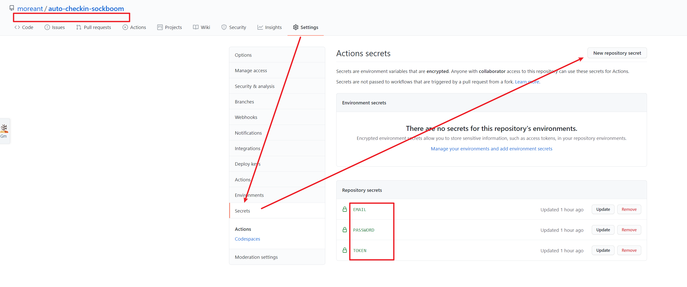

# 食用指南

## 1. Fork 仓库

首先点在[此仓库](https://github.com/moreant/auto-checkin-sockboom)中点击右上角的 fork 按钮，把此仓库复制到你自己的账号中

复制成功后再次点击 fork 按钮 可以看到你自己 fork 好的仓库地址，**此后的操作都将在自己仓库中进行！**

## 2. 生成 token

首先进入自己的 setting 中，生成一个有仓库权限的 token.

在 setting -> Developer settings -> Personal access token -> New personal access token .

建议起一个这个与这个仓库名有关的名字，方便后续管理。
勾选 reop 权限中的 public_repo 然后在下面点击 Generate token 即可

生成成功后复制好这个 token 记住，这个token**只会显示一次**

## 3. 设置 secrets

在自己仓库中的 Setting -> secrets -> New repository secrets.
fork后的参考在名称下面会有 forked form xxxx

之后设置下面这三个 secret：

- `TOKEN`: 上文生成好的 Github TOKEN
- `EMAIL`: 你 sockboom 的邮箱
- `PASSWORD`: 你 sockboom 的密码

## 4. 开通 Actions 功能

进入并开通仓库中的 actions.

点击右上角的 start 按钮，重新进入 actions, 可以看到自动任务已启动。
